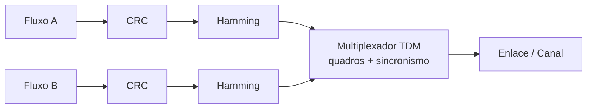
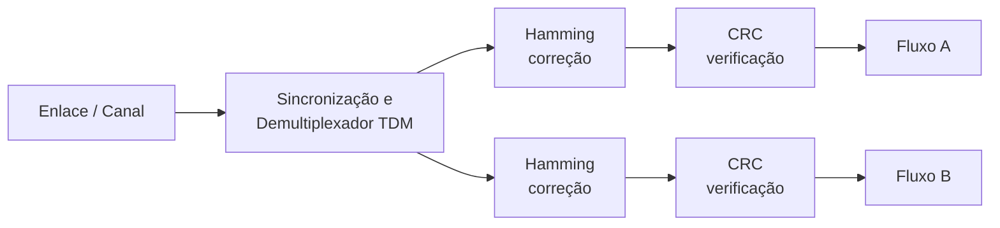

# 📡 Multiplexação TDM com Detecção e Correção de Erros


Projeto da disciplina de Comunicação de Dados que simula um enlace de comunicação digital capaz de **multiplexar dois fluxos de bits via TDM**, protegendo os dados com **CRC** (detecção de erros) e **código de Hamming**, recuperando cada fluxo separadamente no receptor.

---

## 📑 Sumário

- [Visão geral](#-visão-geral)
- [Como funciona](#-como-funciona)
- [Arquitetura](#-arquitetura)
- [Estrutura do repositório](#-estrutura-do-repositório)
- [Como executar](#-como-executar)
- [Testes](#-testes)
- [Divisão de tarefas](#-divisão-de-tarefas)
- [Equipe](#-equipe)

---

## 🎯 Visão geral

O sistema combina **pelo menos dois fluxos de bits identificáveis** (Fluxo A e Fluxo B) em um único canal e é capaz de separá-los corretamente no receptor, mesmo quando ocorrem erros de transmissão.

| Recurso | Técnica adotada |
|---|---|
| Multiplexação | **TDM** síncrono (quadros com *slots* fixos) |
| Detecção de erros | **CRC** (CRC-8 / CRC-16) |
| Correção de erros | **Hamming** (ex.: Hamming(7,4), corrige 1 bit por palavra) |

### Por que TDM?

- É naturalmente digital e combina com fluxos de bits, CRC e Hamming.
- Implementação simples: intercalação por posição no quadro, sem filtros (FDM) nem transformadas (OFDM).
- Cada fluxo é identificado pela posição do *slot*, com apoio de um padrão de sincronização.

---

## ⚙️ Como funciona

Cada quadro TDM tem a seguinte estrutura:

```
|  SYNC  |  SLOT A  |  SLOT B  |  SYNC  |  SLOT A  |  SLOT B  | ...
 \_____________ quadro n _____/ \_____________ quadro n+1 ____/
```

1. **Transmissor:** cada fluxo recebe um CRC, depois é codificado com Hamming; em seguida, os slots são montados nos quadros TDM e enviados ao canal.
2. **Canal:** pode injetar erros (inversão de bits) para testar a robustez do sistema.
3. **Receptor:** sincroniza o quadro, demultiplexa os slots, corrige erros com Hamming e verifica o CRC de cada fluxo.

---

## 🧩 Arquitetura

### Transmissor



### Receptor



> A multiplexação ocorre **depois** da proteção contra erros no transmissor e **antes** dela no receptor, mantendo a simetria entre os dois lados.

---

## 📁 Estrutura do repositório

> Ajuste conforme a organização real do projeto.

```
.
├── src/
│   ├── enlace/          # transmissão e recepção de bits
│   ├── tdm/             # multiplexação e demultiplexação
│   ├── crc/             # geração e verificação de CRC
│   └── hamming/         # codificação e correção Hamming
├── tests/               # casos de teste (injeção de erros)
├── docs/                # documentação e marcos (LaTeX/PDF)
└── README.md
```

---

## 🚀 Como executar


---

## 🧪 Testes

Os testes verificam, entre outros pontos:

- [ ] Separação correta dos fluxos A e B após o TDM.
- [ ] Detecção de erros pelo CRC (sem correção).
- [ ] Correção de erro de 1 bit por palavra com Hamming.
- [ ] Comportamento com múltiplos erros (erro detectado, mas não corrigível).
- [ ] Ressincronização de quadro.

```bash
# [comando para rodar os testes]
```

---

## 📋 Divisão de tarefas

| Integrante | Responsabilidade | Área |
|---|---|---|
| **João** | Enlace (transmissão/recepção de bits) e multiplexação/demultiplexação TDM com sincronismo de quadro | Enlace e TDM |
| **Lenon** | Detecção de erros: geração e verificação do CRC, com sinalização de quadros corrompidos | CRC |
| **Ryan** | Correção de erros: codificação Hamming e correção de bits errados no receptor | Hamming |
| **Todos** | Integração dos módulos, casos de teste e documentação | Integração e testes |

---

## 🗺️ Marcos do projeto

- [x] **Marco 1:** proposta (equipe, técnica, arquitetura e divisão de tarefas)
- [ ] **Marco 2:** implementação dos módulos individuais
- [ ] **Marco 3:** integração e testes
- [ ] **Entrega final**

---

## 👥 Equipe

| | Nome | GitHub |
|---|---|---|
| 🧑‍💻 | João | [@JP-Souto](https://github.com/JP-Souto) |
| 🧑‍💻 | Lenon | [@LenonGP](https://github.com/LenonGP) |
| 🧑‍💻 | Ryan | [@QXZM-ryan](https://github.com/QXZM-ryan) |

---

<p align="center">

</p>
